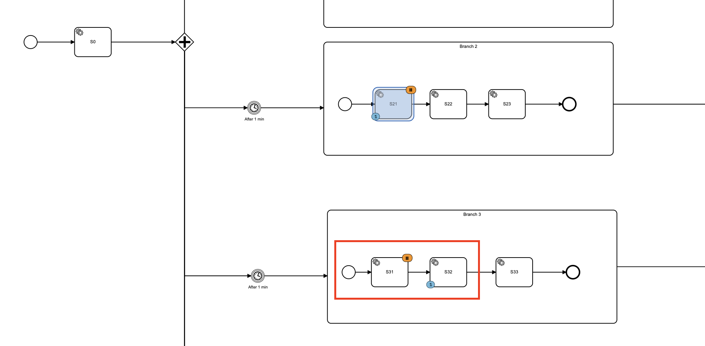

Test Example
===

### How to build
Build all modules using `mvn clean install` using the repo root pom.xml.

### How to build the docker image

In order to run the text example, the following requirements must be met:
- Docker must be installed.
- The application must be built (check above).
- You need to create a postgres role "test" : `createuser -P -s test`
- Run the docker file.

### Job definition suspension issue

